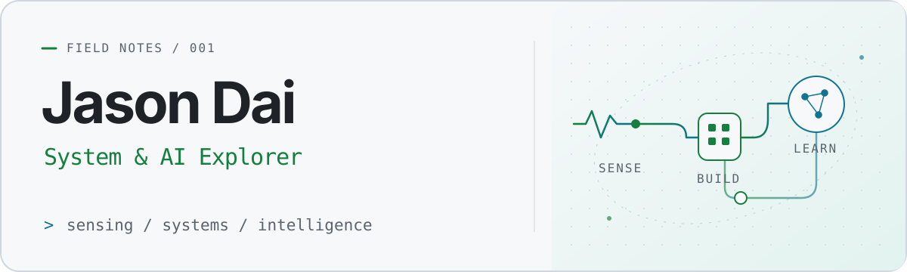

<picture>
  <source media="(prefers-color-scheme: dark)" srcset="assets/profile-dark.svg">
  
</picture>

  <b>Jason Dai · 西安交通大学</b> 
  Building small things. Understanding big systems.  
  <a href="https://luvch1nabest.me">Personal website ↗</a>
  &nbsp; / &nbsp;
  <a href="https://github.com/donald-trump86">GitHub</a>
  &nbsp; / &nbsp;
  <a href="https://steamcommunity.com/profiles/76561199223560942/">Steam</a>

## 01 / About

你好，我是 Jason，西安交通大学**测控技术与仪器（智能感知）方向**本科生。

对 AI 如何工作、系统如何协同，以及感知数据怎样变成有用的信息充满好奇。正在探索 **AI 与深度学习、系统架构和网络**，也会把日常遇到的小问题做成小工具。

> 从传感器到终端，从一个脚本到一个系统。边学，边做，边弄明白。

## 02 / Selected work

### [DSH Bar for macOS ↗](https://github.com/donald-trump86/dsh-bar-macos)

**把服务管理收进菜单栏。**

为 DeepSeek Harness 写的原生 macOS 菜单栏助手：查看服务状态、启停服务、打开 Web 界面与日志，少一些来回切换。

`Swift` · `macOS` · `Developer tools`

### [交小西 · DormSense ↗](https://github.com/donald-trump86/xiaoxi-dormsense)

**让宿舍里的感知数据，走向一个可交互的小系统。**

`Under development / 课程项目`

`Python` · `Smart sensing` · `IoT`

#### Small tools, real problems

- [**Quick-ZSH**](https://github.com/donald-trump86/Quick-ZSH) — zsh 安装与初始化脚本，让新环境少一点重复操作。
- [**Selfuse-IPA-Source**](https://github.com/donald-trump86/Selfuse-IPA-Source) — 自用 IPA 侧载源，整理自己需要的应用。

## 03 / Toolkit & exploring

**写代码时**

   Swift
  &nbsp; · &nbsp;
   Python
  &nbsp; · &nbsp;
   C/C++
  &nbsp; · &nbsp;
   Shell

**切换环境时**

   macOS
  &nbsp; · &nbsp;
   CachyOS
  &nbsp; · &nbsp;
   Windows

**正在学习** · AI 原理与深度学习 / 系统架构 / 网络与 OpenWrt

工具会变，想把原理弄明白的好奇心不变。

## 04 / Beyond the terminal

终端之外，我也会玩游戏，以及去健身。

   Minecraft
  &nbsp; · &nbsp;
   Call of Duty

  <a href="https://luvch1nabest.me">来我的个人网站坐坐 ↗</a>
  &nbsp; / &nbsp;
  <a href="https://github.com/donald-trump86"> GitHub</a>
  &nbsp; / &nbsp;
  <a href="https://steamcommunity.com/profiles/76561199223560942/"> Steam</a>

---

Keep exploring. Keep building. Stay curious.

  
Visual credits

  
Header artwork created for this profile. Technology icons: <a href="https://devicon.dev/">Devicon</a>, served through jsDelivr at v2.17.0. Shell, CachyOS and social icons: <a href="https://simpleicons.org/">Simple Icons</a>. Game artwork: <a href="https://commons.wikimedia.org/wiki/File:Grass_block_stylized.svg">Minecraft-like grass block</a> and <a href="https://commons.wikimedia.org/wiki/File:Call_of_Duty_logo.svg">Call of Duty wordmark</a> via Wikimedia Commons; the wordmark is recolored for both themes. Brand marks belong to their respective owners.

